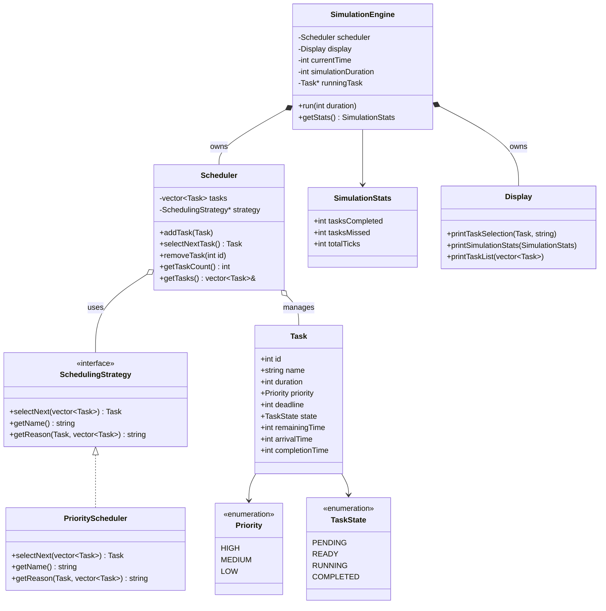
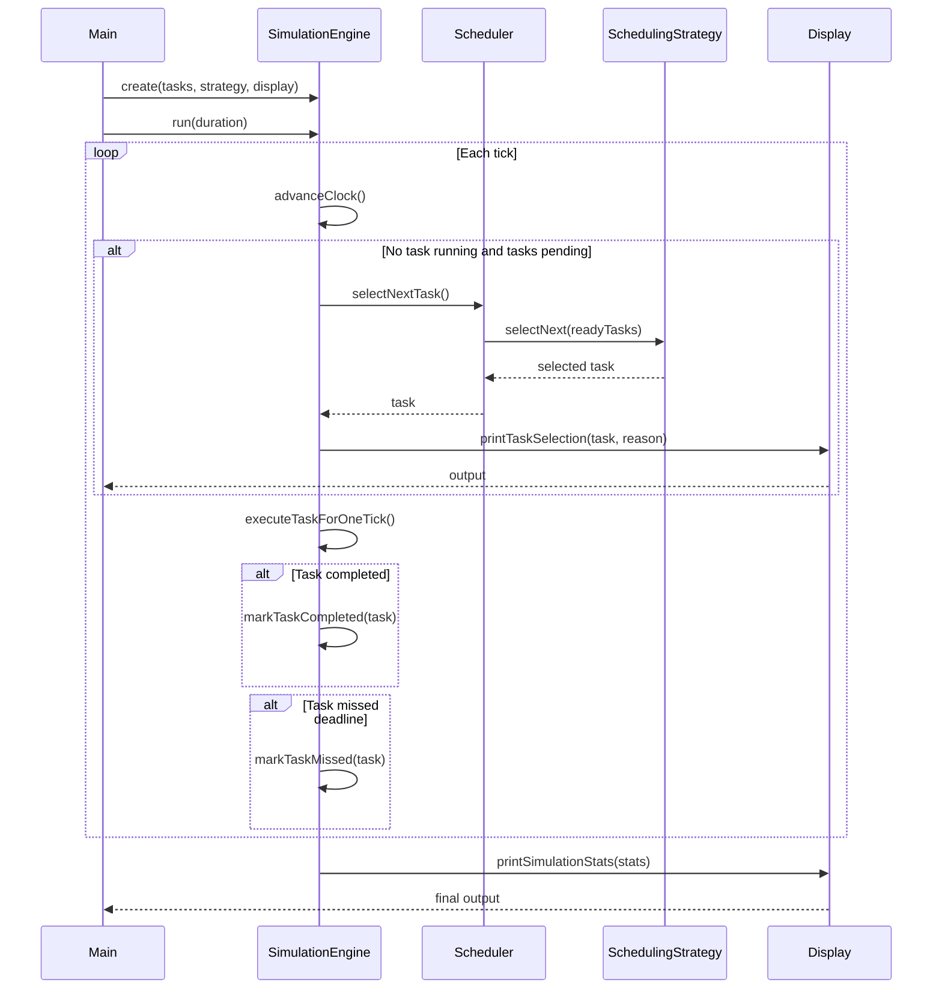

# Architecture — Real-Time Task Scheduler

## 1. Overview

This project implements a simplified real-time task scheduler in C++17 that manages tasks in memory, selects the next task to execute based on a pluggable scheduling strategy, and visualizes scheduling decisions. The architecture separates concerns into five distinct modules: Task, Scheduler, Scheduling Strategies, Simulation Engine, and Output System.

---

## 2. Module Definitions

### 2.1 Task Module

**Responsibility:** Represents a single task and its properties.

**Key classes:**

- `Task` — data class holding:
  - `id` (int) — unique identifier
  - `name` (string) — human-readable name
  - `duration` (int) — estimated execution time in milliseconds
  - `priority` (Priority enum: HIGH, MEDIUM, LOW)
  - `deadline` (int) — absolute deadline in milliseconds
  - `state` (TaskState enum: PENDING, READY, RUNNING, COMPLETED)

- `Priority` — enum class for priority levels
- `TaskState` — enum class for task lifecycle states

**Validation rules:**
- Duration must be positive
- Deadline must be positive and greater than duration
- Priority must be a valid enum value

**Files:** `include/task.h`, `src/task.cpp`

---

### 2.2 Scheduler Module

**Responsibility:** Manages the task queue and coordinates scheduling decisions.

**Key classes:**

- `Scheduler` — core scheduler that:
  - Maintains a priority queue of tasks
  - Holds a reference to a pluggable `SchedulingStrategy`
  - Exposes `addTask()`, `selectNextTask()`, `removeTask()`, `getTaskCount()`
  - Delegates selection logic to the injected strategy

**Design:**
- The Scheduler does not know *how* tasks are ordered — it delegates to the strategy
- Strategies can be swapped at runtime (e.g., switch from priority to EDF)

**Files:** `include/scheduler/scheduler.h`, `src/scheduler/scheduler.cpp`

---

### 2.3 Scheduling Strategies Module

**Responsibility:** Encapsulates the decision-making logic for selecting the next task.

**Key classes:**

- `SchedulingStrategy` (abstract interface):
  - `virtual Task selectNext(std::vector<Task>& tasks) = 0`
  - `virtual std::string getName() const = 0`
  - `virtual std::string getReason(const Task& task, const std::vector<Task>& candidates) const = 0`

- `PriorityScheduler` (MVP implementation):
  - Selects by: highest priority → closest deadline → shortest duration
  - Provides human-readable reason for selection

**Future strategies (not in MVP):**
- `EDFScheduler` — Earliest Deadline First
- `SJFScheduler` — Shortest Job First
- `FCFSScheduler` — First Come First Served
- `RMSScheduler` — Rate Monotonic Scheduling

**Files:**
- Interface: `include/scheduler/strategies/scheduling_strategy.h`
- MVP impl: `include/scheduler/strategies/priority_scheduler.h`, `src/scheduler/strategies/priority_scheduler.cpp`

---

### 2.4 Simulation Engine Module

**Responsibility:** Drives the scheduler through simulated time, executing tasks and collecting statistics.

**Key classes:**

- `SimulationEngine`:
  - Owns a `Scheduler` and a `Display`
  - Manages a virtual clock (current time in ms)
  - Runs a tick loop: each tick advances time, checks for completed tasks, invokes scheduler if CPU is idle
  - Tracks statistics: total tasks completed, tasks missed deadline, average waiting time
  - Exposes `run(int duration)` for a fixed simulation window
  - Exposes `getStats()` to retrieve summary statistics

**Simulation flow:**
1. Initialize engine with task list and scheduling strategy
2. Start simulation at time = 0
3. Each tick:
   - If no task is running and tasks are pending, select next task via scheduler
   - Advance current task's remaining duration
   - If task completes, mark COMPLETED and record finish time
   - If current time passes a task's deadline, mark as missed
4. After all tasks complete or time expires, print statistics

**Files:** `include/simulation/engine.h`, `src/simulation/engine.cpp`

---

### 2.5 Output System Module

**Responsibility:** Formats and displays scheduling decisions and results.

**Key classes:**

- `Display`:
  - `printTaskSelection(const Task& task, const std::string& reason)` — shows selected task and why
  - `printSimulationStats(const SimulationStats& stats)` — shows completion summary
  - `printTaskList(const std::vector<Task>& tasks)` — shows all tasks with properties
  - Extensible: future versions can output to files or JSON

**Files:** `include/output/display.h`, `src/output/display.cpp`

---

## 3. Class Diagram



---

## 4. Sequence Diagram — Scheduling Flow



---

## 5. Directory Structure

```
real-time-task-scheduler/
├── CMakeLists.txt
├── README.md
├── docs/
│   ├── problem.md
│   ├── specifications.md
│   └── architecture.md
├── include/
│   ├── task.h
│   ├── scheduler/
│   │   ├── scheduler.h
│   │   └── strategies/
│   │       ├── scheduling_strategy.h
│   │       └── priority_scheduler.h
│   ├── simulation/
│   │   └── engine.h
│   └── output/
│       └── display.h
├── src/
│   ├── main.cpp
│   ├── task.cpp
│   ├── scheduler/
│   │   ├── scheduler.cpp
│   │   └── strategies/
│   │       └── priority_scheduler.cpp
│   ├── simulation/
│   │   └── engine.cpp
│   └── output/
│       └── display.cpp
└── tests/
    ├── task_test.cpp
    ├── scheduler_test.cpp
    └── simulation_test.cpp
```

---

## 6. MVP Scope

### In scope

- Task creation with validation (id, name, duration, priority, deadline)
- In-memory task storage via Scheduler
- Priority-based scheduling (priority → deadline → shortest duration)
- Simulation engine with tick-based time progression
- Console output showing scheduling decisions and statistics
- Unit tests for Task, Scheduler, and SimulationEngine

### Out of scope (future)

- EDF, RMS, SJF, FCFS algorithms
- Task dependencies
- Multithreading / multicore scheduling
- Real OS integration
- Persistent storage
- Graphical interface
- Performance benchmarking suite
