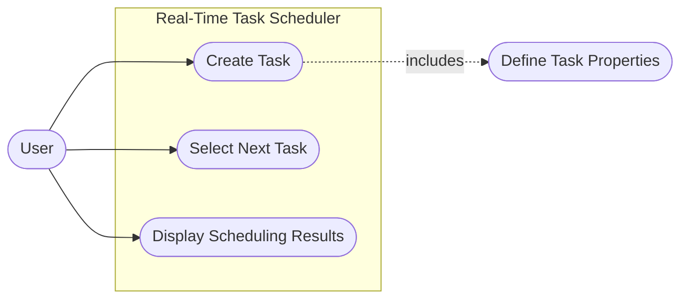

# Use Case Diagram — Real-Time Task Scheduler

## 1. Overview

The Use Case Diagram describes the main interactions between the user and the Real-Time Task Scheduler.

The MVP focuses on the core scheduling workflow:

1. Creating tasks
2. Defining task properties
3. Selecting the next task to execute
4. Displaying the scheduling decision

The scheduling algorithm and task management are internal responsibilities of the system and are therefore not represented as external actors.

---

## 2. Actor

### 2.1 User

The **User** is the main external actor interacting with the Real-Time Task Scheduler.

The User can:

* Create tasks
* Define task properties
* Request the selection of the next task
* View the scheduling results

The User does not directly interact with the scheduling algorithm. The scheduling decision is performed internally by the system.

---

## 3. Use Case Diagram



---

# 4. Use Case Descriptions

## UC01 — Create Task

### Description

Allows the user to create a new task that will be managed by the scheduler.

### Actor

**User**

### Preconditions

* The Real-Time Task Scheduler is running.
* The task information is available.

### Trigger

The user requests the creation of a new task.

### Main Success Scenario

1. The User provides the task information.
2. The system receives the task properties.
3. The system validates the provided information.
4. The system creates the task.
5. The system stores the task in memory.
6. The task becomes available to the scheduler.

### Task Properties

A task contains:

* Unique identifier
* Name
* Execution duration
* Priority
* Deadline

### Postconditions

* A valid task has been created.
* The task is stored in the scheduler.
* The task can be considered for future scheduling decisions.

### Alternative / Exception Flows

* If the identifier is invalid or not unique, the task creation is rejected.
* If the duration is not positive, the task creation is rejected.
* If the priority is invalid, the task creation is rejected.
* If the deadline does not satisfy the project constraints, the task creation is rejected.

---

## UC02 — Define Task Properties

### Description

Defines the properties associated with a task during task creation.

This use case is included by **UC01 — Create Task** because a task cannot be created without its required properties.

### Actor

**User**

### Preconditions

* The User is creating a task.

### Main Success Scenario

1. The User provides a unique identifier.
2. The User provides a task name.
3. The User provides an execution duration.
4. The User selects a priority.
5. The User provides a deadline.
6. The system validates the provided properties.

### Supported Priority Levels

The MVP defines three priority levels:

```text
HIGH
MEDIUM
LOW
```

### Validation Rules

* Duration must be positive.
* Priority must be one of the supported priority levels.
* Deadline must satisfy the project constraints.

### Postconditions

* The task properties are validated.
* The properties can be used to create the task.

---

## UC03 — Select Next Task

### Description

Allows the User to request the selection of the next task to execute.

The scheduler evaluates the available tasks and selects the most appropriate task according to the MVP scheduling strategy.

### Actor

**User**

### Preconditions

* The Real-Time Task Scheduler is running.
* At least one task is available for scheduling.

### Trigger

The User requests the selection of the next task.

### Main Success Scenario

1. The User requests the next scheduling decision.
2. The system retrieves the available tasks.
3. The scheduler evaluates the available tasks.
4. The scheduling strategy compares the task properties.
5. The system first considers task priority.
6. If necessary, the system considers deadline urgency.
7. If necessary, the system considers execution duration.
8. The scheduler selects the next task.
9. The selected task is returned to the User.

### MVP Scheduling Decision

The MVP uses the following decision order:

```text
Highest Priority
       ↓
Closest Deadline
       ↓
Shortest Duration
```

### Example

Given:

```text
Task A:
Priority: HIGH
Deadline: 500ms
Duration: 100ms

Task B:
Priority: LOW
Deadline: 50ms
Duration: 20ms
```

The scheduler selects **Task A** because priority is the first scheduling criterion.

### Postconditions

* One task has been selected as the next task to execute.
* The scheduling decision is deterministic for the same input.

### Alternative / Exception Flows

* If no task is available, the system cannot select a task.
* The system reports that no task is currently available for scheduling.

---

## UC04 — Display Scheduling Results

### Description

Displays the result of the scheduling decision to the User.

The output provides information about the selected task and explains why it was selected.

### Actor

**User**

### Preconditions

* A scheduling decision has been performed.
* A task has been selected.

### Main Success Scenario

1. The scheduler selects a task.
2. The system retrieves the selected task's properties.
3. The system determines the reason for the selection.
4. The system displays the selected task.
5. The system displays the task properties.
6. The system displays the reason for the scheduling decision.

### Output Information

The displayed result should include:

* Task identifier
* Task name
* Priority
* Duration
* Deadline
* Reason for selection

### Example

```text
Next task selected:

ID: 3
Name: Network packet processing
Priority: HIGH
Duration: 50ms
Deadline: 200ms

Reason:
Highest priority task.
```

### Postconditions

* The scheduling decision is visible to the User.

---

# 5. Use Case Relationships

## UC01 — Create Task → UC02 — Define Task Properties

`Create Task` **includes** `Define Task Properties`.

Creating a task requires the User to provide and validate the required task properties.

---

## UC03 — Select Next Task → Scheduling Strategy

The scheduling strategy is an internal system responsibility.

It is not represented as an external actor or user-facing use case.

The scheduler internally applies the configured strategy to determine which task should be selected.

---

## UC03 — Select Next Task → UC04 — Display Scheduling Results

After a scheduling decision has been made, the selected task and the reason for its selection are displayed to the User.

The display is therefore part of the scheduling workflow.

---

# 6. MVP Scope

The following functionality is included in the MVP:

* Create tasks
* Define task properties
* Store tasks in memory
* Select the next task
* Apply the MVP scheduling strategy
* Display scheduling decisions

The MVP scheduling strategy follows:

```text
Priority
    ↓
Deadline
    ↓
Duration
```

---

# 7. Out of Scope

The following features are not part of the current MVP:

* Earliest Deadline First (EDF)
* Rate Monotonic Scheduling (RMS)
* Shortest Job First (SJF)
* First Come First Served (FCFS)
* Multithreading
* Multicore scheduling
* Real operating system integration
* Persistent storage
* Graphical interface
* Distributed scheduling
* Machine learning optimization
* Task dependencies
* Performance benchmarking

These features may be considered in future versions of the project.
